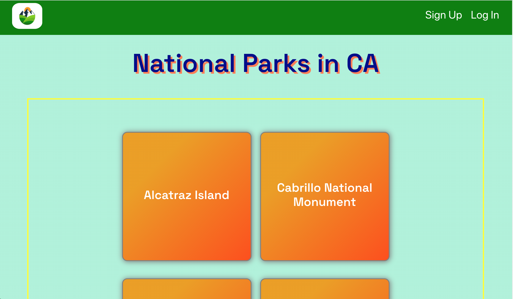

# Introduction

This is a web app that allows a user to search for National Parks by State using the NPS API. As a logged in user, you can view each park for a description, list of activities and leave comments about your experience.

# Technologies Used
 
 - React
 - JavaScript
 - JSX
 - Node.js
 - Express.js
 - HTML5
 - CSS3
 - Bootstrap
 - NPS API
 - Google Fonts
 - MongoDB
 - Mongoose
 - Bcrypt

 # Getting Started

 See project planning via [Trello](https://trello.com/b/VJgcyFQa/national-park-finder).

 See the deplyed app [here](https://project-3-frontend.herokuapp.com/)!

 # Wireframes
 ERD
 
 Home Page
 
 List Page
 
 Sign Up Page
 
 Log In Page
 
 Detail Page
 

 # Screenshots
 Home Page
 
 List Page
 
 Sign Up Page
 
 Log In Page
 
 Detail Page
 

 # Future Enhancements

 Allow users to save each park they visited in a list. Also, allow them to create a list of parks the want to vist next.
